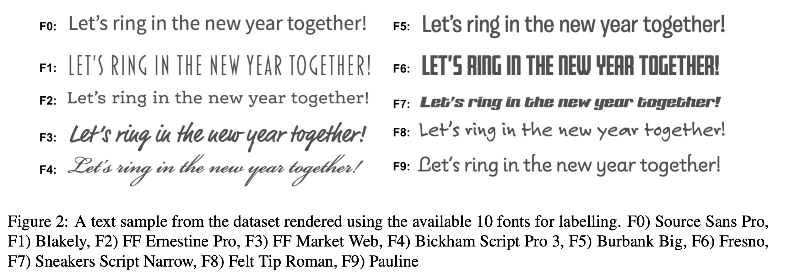

# Font-prediction-dataset
This is a repository for the ACL 2020 paper: "Let Me Choose: From Verbal Context to Font Selection"

The proposed dataset includes 1,309 short text instances from Adobe Spark. The dataset is a collection of publicly available sample texts created by different designers. It covers a variety of topics found in posters, flyers, motivational quotes and advertisements.

Examples from our collected dataset, visualized through fonts with the highest annotation agreements.

### Data Format
We are currently releasing annotated data in .csv files.  

<table class="tg">
  <tr>
    <th class="tg-cly1">#</th>
    <th class="tg-0lax">text</th>
    <th class="tg-0lax">F0</th>
    <th class="tg-0lax">F1</th>
    <th class="tg-0lax">F2</th>
    <th class="tg-0lax">F3</th>
    <th class="tg-0lax">F4</th>
    <th class="tg-0lax">F5</th>
    <th class="tg-0lax">F6</th>
    <th class="tg-0lax">F7</th>
    <th class="tg-0lax">F8</th>
    <th class="tg-0lax">F9</th>
  </tr>
</table>

### Font Mappings

  F0: Source-sans-pro	 
  F1: Blakely	
  F2: FF-ernestine-pro	
  F3: FF-market-web	
  F4: Bickham-script-pro-3	
  F5: Burbank-big	
  F6: Fresno	
  F7: Sneakers-script-narrow	
  F8: Felt-tip-roman	
  F9: Pauline
 

